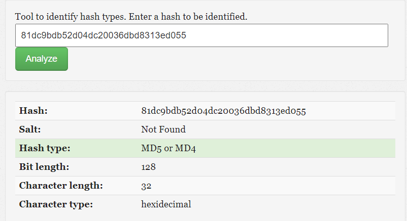

Określenie typu wykorzystanego algorytmu hashującego za pomocą strony:
www.tunnelsup.com/hash-analyzer/ lub innego narzędzia.

Następnie rozszyfrowanie hasła za pomoca hashcat lub innych dostępnych opcji.

1. 81dc9bdb52d04dc20036dbd8313ed055

![[Pasted image 20230514110751.png]]

Wynik: 1234

2. d8826bbd80b4233b7522d1c538aeaf66c64e259a
![[Pasted image 20230514102654.png]]

hashcat -a 0 -m 100 2.txt /usr/share/wordlists/rockyou.txt

![[Pasted image 20230514105150.png]]

Wynik: 4121

3. b021d0862bc76b0995927902ec697d97b5080341a53cd90b780f50fd5886f4160bbb9d4a573b76c23004c9b3a44ac95cfde45399e3357d1f651b556dfbd0d58f
![[Pasted image 20230514102747.png]]

hashcat -a 0 -m 1700 3.txt /usr/share/wordlists/rockyou.txt

![[Pasted image 20230514105540.png]]

Wynik: 6969

4. 31bca02094eb78126a517b206a88c73cfa9ec6f704c7030d18212cace820f025f00bf0ea68dbf3f3a5436ca63b53bf7bf80ad8d5de7d8359d0b7fed9dbc3ab99
![[Pasted image 20230514102841.png]]

hashcat -a 0 -m 1700 4.txt /usr/share/wordlists/rockyou.txt 

![[Pasted image 20230514110047.png]]

Wynik: 0

5. 9e66d646cfb6c84d06a42ee1975ffaae90352bd016da18f51721e2042d9067dcb120accc5741
05b43139b6c9c887dda8202eff20cc4b98bad7b3be1e471b3aa5

![[Pasted image 20230514113230.png]]

hashcat -a 3 -m 1700 9e66d646cfb6c84d06a42ee1975ffaae90352bd016da18f51721e2042d9067dcb120accc574105b43139b6c9c887dda8202eff20cc4b98bad7b3be1e471b3aa5

![[Pasted image 20230514123040.png]]

Wynik: sda

6. 8a04bd2d079ee38f1af784317c4e2442625518780ccff3213feb2e207d2be42ca0760fd847618
4a004b71bcb5841db5cd0a546b9b8870f1cafee57991077c4a9

![[Pasted image 20230514114005.png]]

hashcat -a 3 -m 1700 8a04bd2d079ee38f1af784317c4e2442625518780ccff3213feb2e207d2be42ca0760fd8476184a004b71bcb5841db5cd0a546b9b8870f1cafee57991077c4a9

![[Pasted image 20230514123220.png]]

Wynik: Asia

7. 44d9886c0a57ddbfdb31aa936bd498bf2ab70f741ee47047851e768db953fc4e43f92be953
e205a3d1b3ab752ed90379444b651b582b0bc209a739a624e109da

![[Pasted image 20230514115201.png]]

hashcat -a 3 -m 1700 44d9886c0a57ddbfdb31aa936bd498bf2ab70f741ee47047851e768db953fc4e43f92be953e205a3d1b3ab752ed90379444b651b582b0bc209a739a624e109da

![[Pasted image 20230515170910.png]]

Niestety moc obliczeniowa dostępnego sprzętu potrzebuje 12 dni na rozszyfrowanie hasła. 