Określenie typu wykorzystanego algorytmu hashującego za pomocą strony:
www.tunnelsup.com/hash-analyzer/ lub innego narzędzia.

Następnie rozszyfrowanie hasła za pomoca hashcat lub innych dostępnych opcji.

1. 9fd8301ac24fb88e65d9d7cd1dd1b1ec
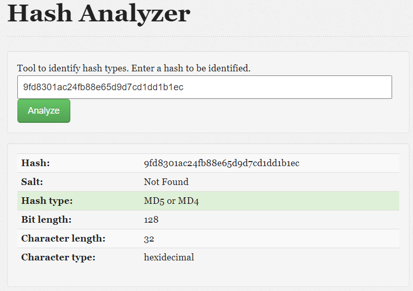

hashcat -a 3 -m 0  9fd8301ac24fb88e65d9d7cd1dd1b1ec /home/kali/Desktop/Projekt2/rockyou.txt

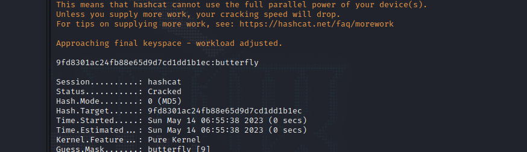

Wynik: butterfly

2. 7f9a6871b86f40c330132c4fc42cda59

hashcat -a 3 -m 0 7f9a6871b86f40c330132c4fc42cda59 /home/kali/Desktop/Projekt2/rockyou.txt

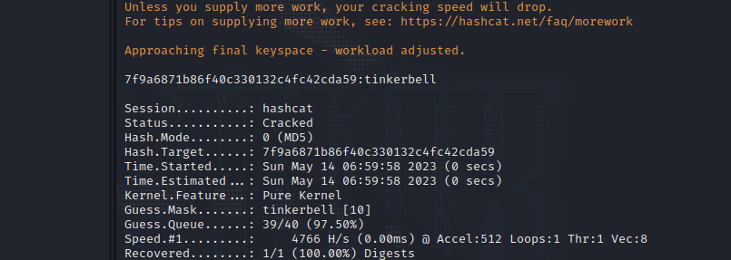

Wynik: tinkerbell

3. 6104df369888589d6dbea304b59a32d4
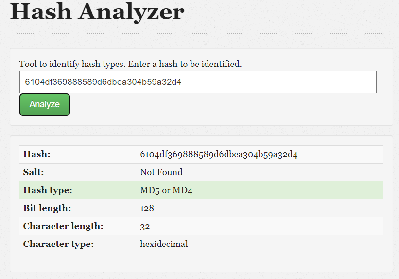

hashcat -a 3 -m 0 6104df369888589d6dbea304b59a32d4 /home/kali/Desktop/Projekt2/rockyou.txt

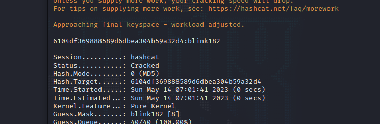

Wynik: blink182

4. 276f8db0b86edaa7fc805516c852c889
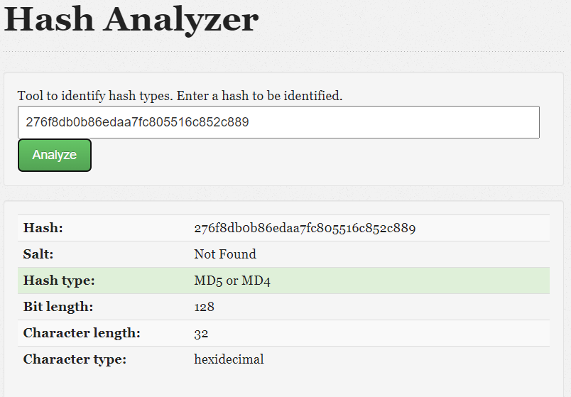

hashcat -a 3 -m 0 276f8db0b86edaa7fc805516c852c889 /home/kali/Desktop/Projekt2/rockyou.txt

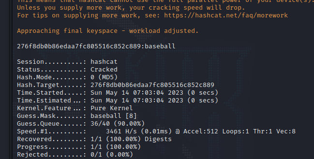

Wynik: baseball

5. 04dac8afe0ca501587bad66f6b5ce5ad
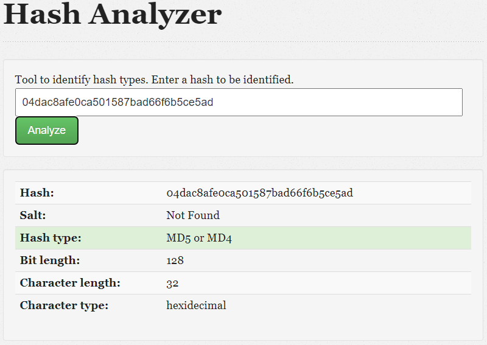

hashcat -a 3 -m 0 04dac8afe0ca501587bad66f6b5ce5ad /home/kali/Desktop/Projekt2/rockyou.txt

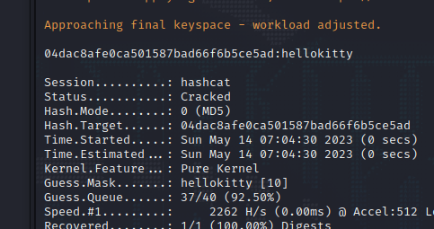

Wynik: hellokitty

6. 7ab6888935567386376037e042524d27fc8a24ef87b1944449f6a0179991dbdbc481e98db4e70f6df0e04d1a69d8e7101d881379cf1966c992100389da7f3e9a

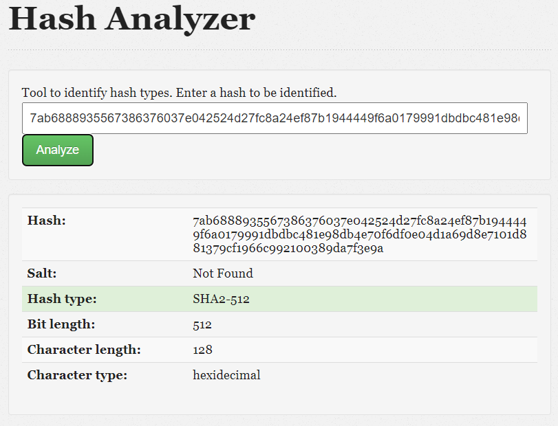

hashcat -a 3 -m 1700 7ab6888935567386376037e042524d27fc8a24ef87b1944449f6a0179991dbdbc481e98db4e70f6df0e04d1a69d8e7101d881379cf1966c992100389da7f3e9a /home/kali/Desktop/Projekt2/rockyou.txt

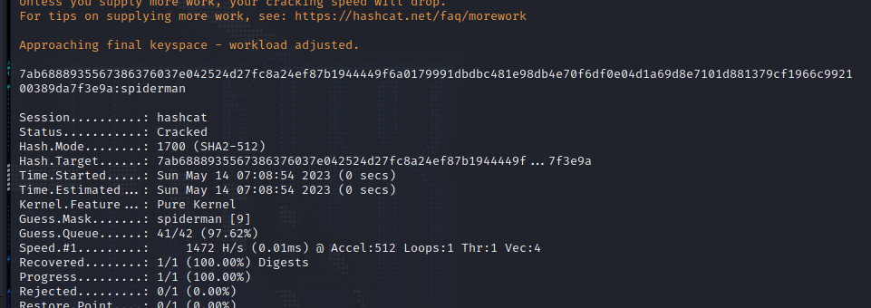

Wynik: spiderman

7. 470c62e301c771f12d91a242efbd41c5e467cba7419c664f784dbc8a20820abaf6ed43e09b0cda994824f14425db3e6d525a7aafa5d093a6a5f6bf7e3ec25dfa
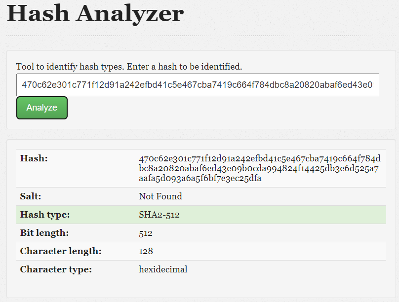

 hashcat -a 3 -m 1700 470c62e301c771f12d91a242efbd41c5e467cba7419c664f784dbc8a20820abaf6ed43e09b0cda994824f14425db3e6d525a7aafa5d093a6a5f6bf7e3ec25dfa /home/kali/Desktop/Projekt2/rockyou.txt

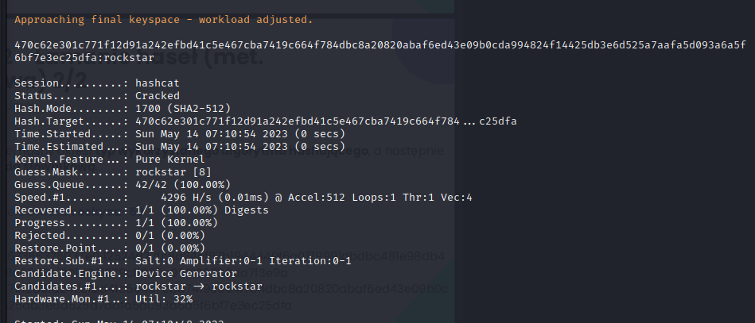

Wynik: rockstar