Maszyna SDA: 
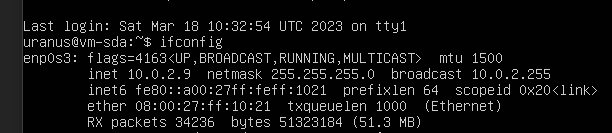

Maszyna Kali: 

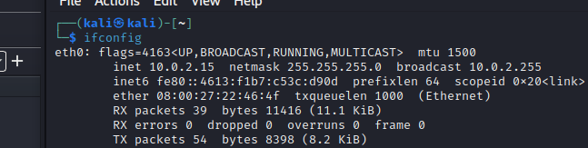

Nawiązanie połączenie pomiędzy Kalim a SDA po SSH

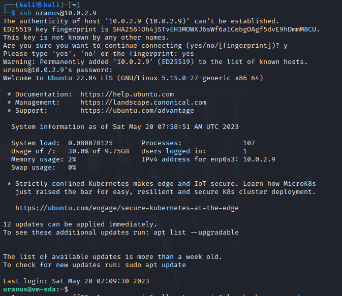

Tworzenie plików sekret1.txt i sekret2.txt z tajnymi hasłami.

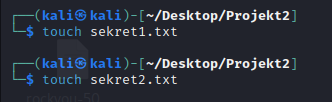
![[20230520100614.png]]

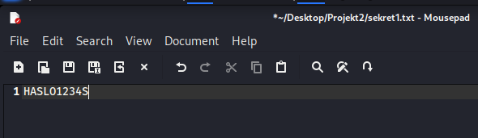

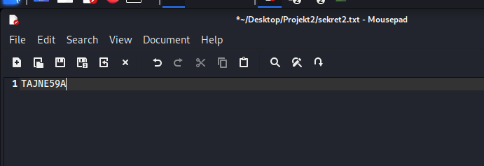

Edycja konfiguracji vsFTPd, żeby umożliwić wgrywanie plików po FTP.

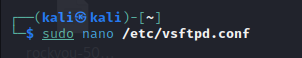

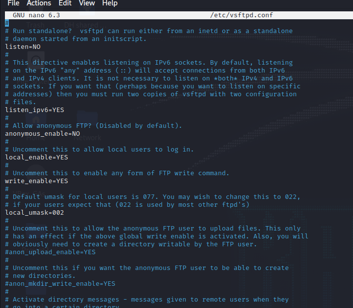

Pobranie plików na maszynę SDA:

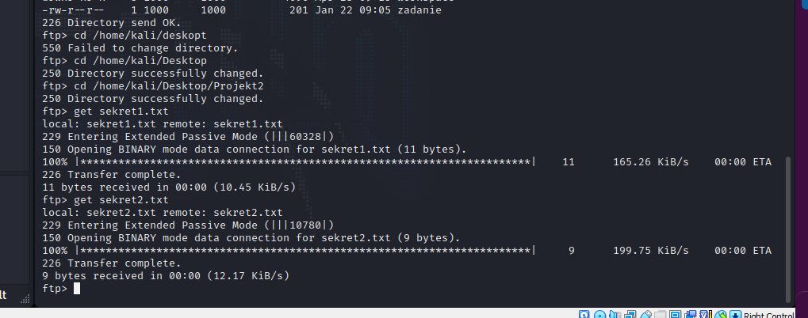
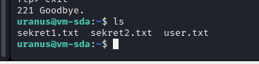

Znalezienie w zapisanym ruchu sieciowym zawartości plików sekret1.txt i sekret2.txt

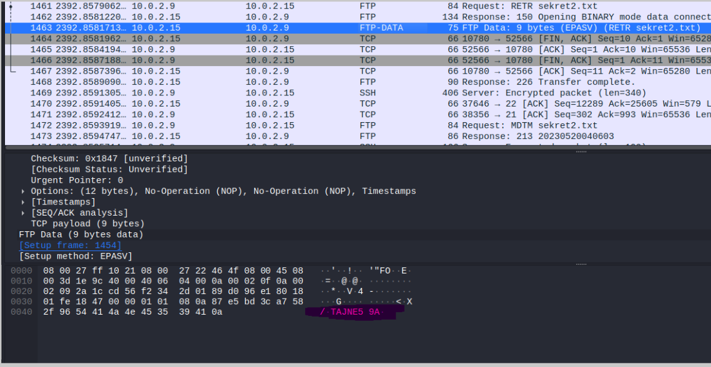

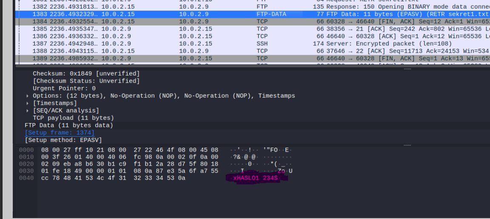

