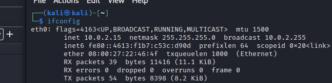

Maszyna SDA: 

Maszyna Kali: 

Nawiązanie połączenie pomiędzy Kalim a SDA po FTP

Przesyłanie z Kaliego do SDA zwykły plik tekstowy (z własną zawartością).

Ściągnięcie z SDA do Kaliego plików sekret1.txt i sekret2.txt oraz odczytanie ich zawartości w zapisanym ruchu sieciowym. 

